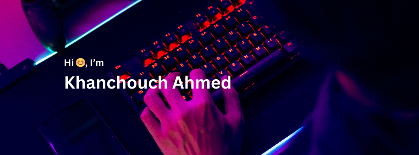

## Hi there 👋

# Hello, I'm [Your Name] 👋

Welcome to my GitHub profile!

## About Me

- 🔭 I’m currently working on [Project]
- 🌱 I’m currently learning [Technology/Language]
- 👯 I’m looking to collaborate on [Project/Technology]
- 💬 Ask me about [Topic]
- 📫 How to reach me: [Email/LinkedIn/Twitter]

## My Projects

- [Project 1](link to project 1)
- [Project 2](link to project 2)

## Skills

- Skill 1
- Skill 2
- Skill 3

## Hobbies

- Hobby 1
- Hobby 2
- Hobby 3

<!--
**ahmedkhanchouch/ahmedkhanchouch** is a ✨ _special_ ✨ repository because its `README.md` (this file) appears on your GitHub profile.

Here are some ideas to get you started:

- 🔭 I’m currently working on ...
- 🌱 I’m currently learning ...
- 👯 I’m looking to collaborate on ...
- 🤔 I’m looking for help with ...
- 💬 Ask me about ...
- 📫 How to reach me: ...
- 😄 Pronouns: ...
- ⚡ Fun fact: ...
-->
